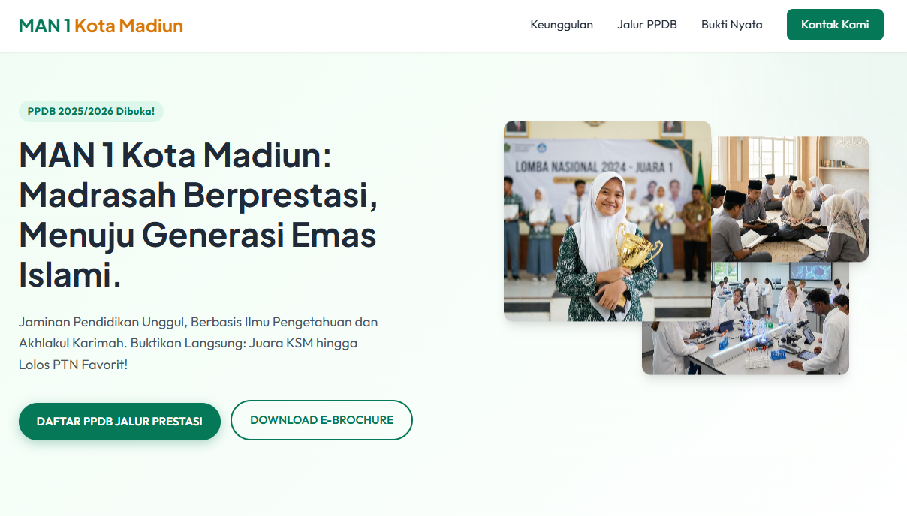
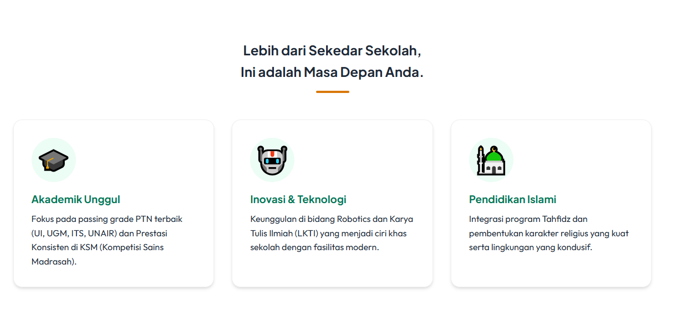
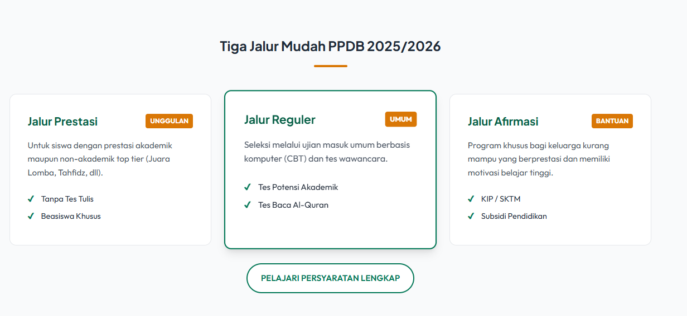
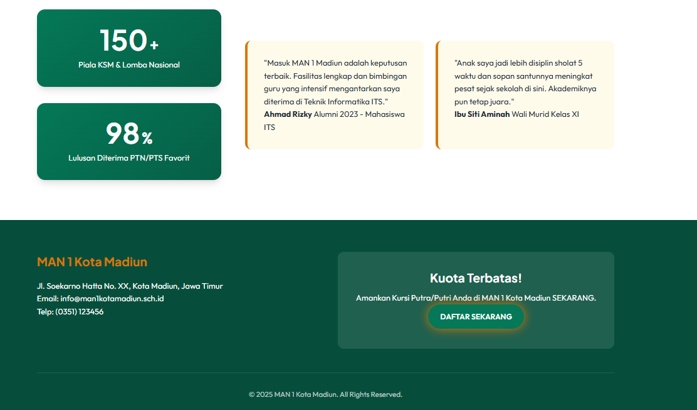

# 🏫 Landing Page PPDB MAN 1 Kota Madiun (2025/2026)

Selamat datang di repositori Landing Page Penerimaan Peserta Didik Baru (PPDB) MAN 1 Kota Madiun. Proyek ini adalah sebuah halaman web statis yang dirancang untuk memberikan informasi yang menarik, informatif, dan persuasif kepada calon siswa dan orang tua.

## 📋 Deskripsi Proyek

Landing page ini dibuat dengan tujuan utama untuk meningkatkan konversi pendaftaran siswa baru melalui desain yang modern, profesional, dan responsif. Halaman ini menonjolkan keunggulan madrasah, jalur pendaftaran, serta bukti prestasi siswa.

**Target Audiens:** Calon siswa SMP/MTs dan Orang Tua di wilayah Madiun dan sekitarnya.
**Tema Desain:** Modern, Trustworthy (Terpercaya), dan Bernuansa Islami (Warna Hijau & Emas).

## ✨ Fitur Utama

- **🎨 Modern & Responsive Design**: Tampilan antarmuka yang bersih dan menyesuaikan ukuran layar (Mobile, Tablet, Desktop).
- **🎞️ Hero Section Dinamis**: Header menarik dengan grid gambar animasi yang menampilkan aktivitas siswa dan prestasi.
- **⚡ Fast Loading**: Dibangun menggunakan HTML5 dan CSS3 murni (Vanilla) tanpa framework berat, menjamin kecepatan akses.
- **📱 Navigasi Intuitif**: Menu navigasi sticky dengan smooth scrolling antar bagian halaman.
- **🔢 Animated Counters**: Fitur penghitung angka animasi untuk menampilkan statistik prestasi (jumlah piala, persentase kelulusan).
- **🦶 Mobile-First Sidebar**: Menu navigasi yang ramah pengguna pada perangkat seluler.

## 🛠️ Teknologi yang Digunakan

*   **HTML5**: Struktur semantik untuk SEO yang lebih baik.
*   **CSS3 (Vanilla)**: Styling custom dengan variabel CSS, Flexbox, dan Grid Layout.
*   **JavaScript (Vanilla)**: Logika interaktif ringan untuk navigasi dan animasi angka.
*   **Google Fonts**: Menggunakan font modern *Plus Jakarta Sans* dan *Outfit*.

## 📂 Struktur Folder

```text
landing-page-MAN1Madiun/
├── 📁 assets/          # Gambar dan aset visual
│   ├── hero_student_trophy.png
│   ├── hero_religious.png
│   └── hero_science.png
├── 📁 css/             # File gaya (stylesheet)
│   └── style.css
├── 📁 js/              # File logika (script)
│   └── script.js
├── index.html          # File utama halaman web
└── README.md           # Dokumentasi proyek
```

## 🚀 Cara Menjalankan

Karena proyek ini adalah web statis, Anda tidak memerlukan instalasi backend atau build tools yang rumit.

1.  **Clone** atau **Download** repositori ini.
2.  Buka folder `landing-page-MAN1Madiun`.
3.  Klik dua kali pada file `index.html` untuk membukanya di browser favorit Anda (Chrome, Firefox, Edge, dll).

## 📸 Pratinjau Tampilan

Berikut adalah cuplikan tampilan dari landing page yang telah dibuat:

### 1. Hero Section
*Tampilan awal yang menyambut pengunjung dengan headline inspiratif.*


### 2. Informasi Keunggulan & Fitur
*Bagian yang menjelaskan keunggulan akademik, teknologi, dan nilai islami.*


### 3. Jalur Pendaftaran (PPDB)
*Pilihan jalur masuk: Prestasi, Reguler, dan Afirmasi.*


### 4. Footer & Kontak
*Informasi kontak resmi dan ajakan bertindak (CTA) terakhir.*


---
*Dibuat untuk MAN 1 Kota Madiun - Menuju Generasi Emas Islami.*
