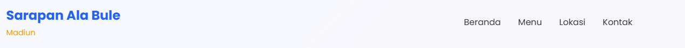
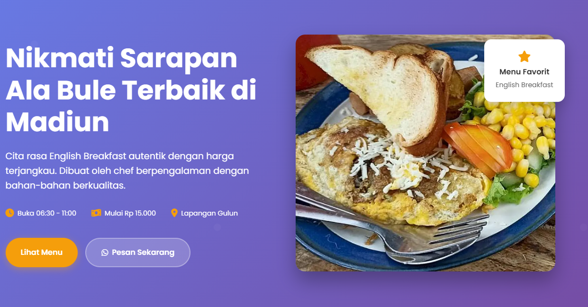
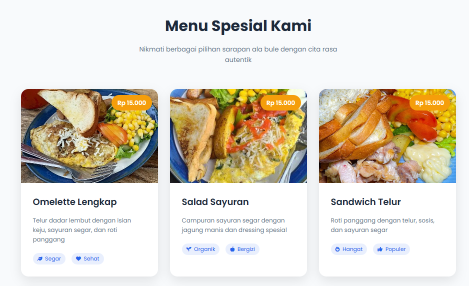
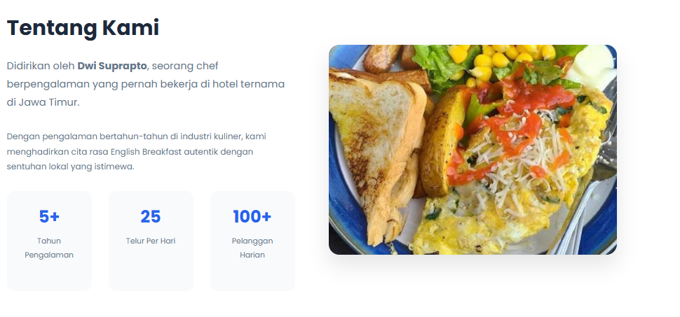
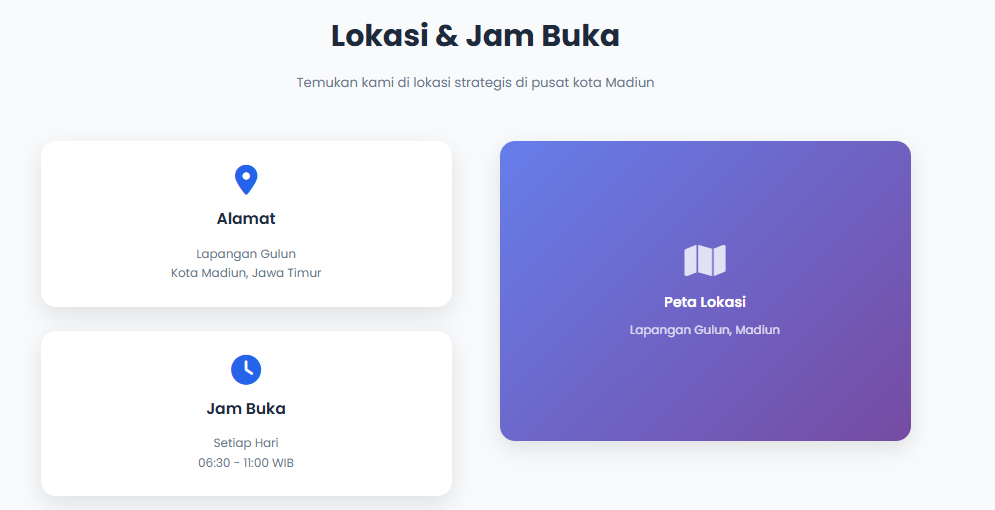
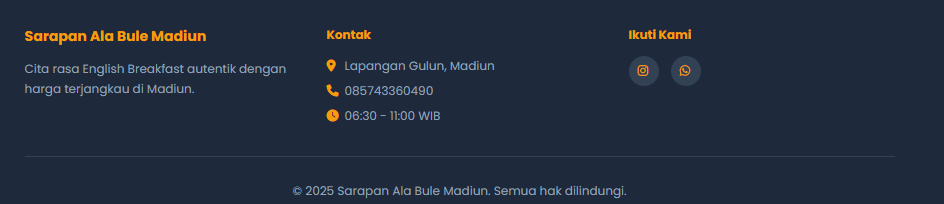

# Sarapan Ala Bule Madiun - Landing Page

Landing page ini dibuat untuk mempromosikan usaha kuliner **Sarapan Ala Bule Madiun**, yang menawarkan menu sarapan ala English Breakfast dengan harga terjangkau di Madiun.

## Fitur Utama

- **Header Navigasi**  
  Navigasi responsif dengan logo, menu, dan hamburger menu untuk mobile.
  

- **Hero Section**  
  Judul utama, deskripsi singkat, fitur jam buka, harga, lokasi, tombol call-to-action, dan gambar makanan utama.
  

- **Menu Section**  
  Galeri menu makanan (Omelette Lengkap, Salad Sayuran, Sandwich Telur, Paket Lengkap) lengkap dengan gambar, deskripsi, fitur menu, dan harga.
  

- **Tentang Kami**  
  Cerita singkat tentang pendiri (Dwi Suprapto), pengalaman, dan statistik usaha.
    
- **Lokasi & Jam Buka**  
  Alamat, jam operasional, kontak, dan peta lokasi (placeholder).
    
- **Kontak & Pemesanan**  
  Informasi kontak WhatsApp dan Instagram, serta tombol pemesanan cepat.

- **Footer**  
  Informasi singkat usaha, kontak, link sosial media, dan copyright.

## Teknologi yang Digunakan

- **HTML5**  
- **CSS3** (dengan responsive design & animasi)
- **JavaScript** (untuk interaksi, animasi, dan efek UX)
- **Font Awesome** (ikon)
- **Google Fonts** (Poppins)

## Struktur Folder

```
landing_page/
├── index.html
├── style.css
├── script.js
├── images/
│   ├── food_1.jpg
│   ├── food_2.jpg
│   ├── food_3.jpg
│   └── food_4.jpg
└── design_structure.md
```

## Cara Kerja (Tanpa Menjalankan Kode)

- **Navigasi** di bagian atas selalu terlihat (sticky).
- **Hero section** menampilkan promosi utama dan tombol aksi.
- **Menu** menampilkan 4 makanan utama dengan harga dan fitur.
- **Tentang Kami** menampilkan profil singkat dan statistik usaha.
- **Lokasi** menampilkan alamat, jam buka, kontak, dan peta.
- **Kontak** menyediakan link WhatsApp & Instagram untuk pemesanan.
- **Footer** berisi info usaha dan sosial media.
- **Responsif**: Tampilan menyesuaikan di layar HP dan tablet.
- **Animasi**: Efek transisi pada elemen saat discroll dan hover.

## Kontak Usaha

- **WhatsApp:** 085743360490
- **Instagram:** [@sarapan_ala_bule_official](https://instagram.com/sarapan_ala_bule_official)
- **Alamat:** Lapangan Gulun, Madiun

---

Landing page ini cocok untuk usaha kuliner yang ingin tampil profesional dan mudah diakses pelanggan secara online.