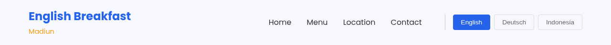
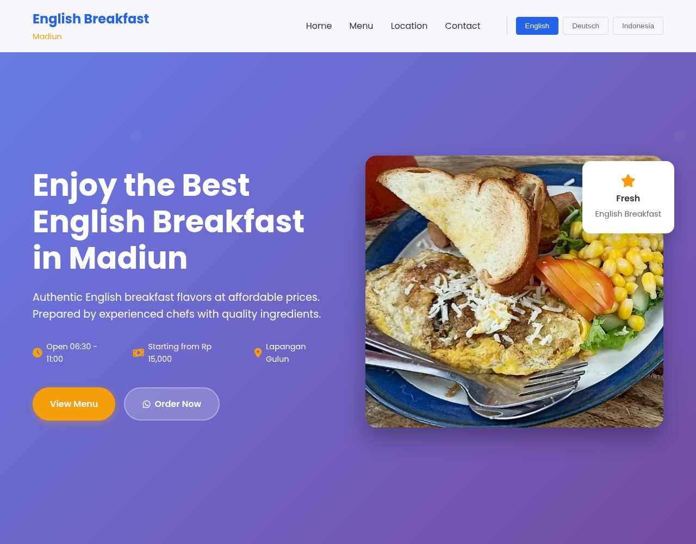
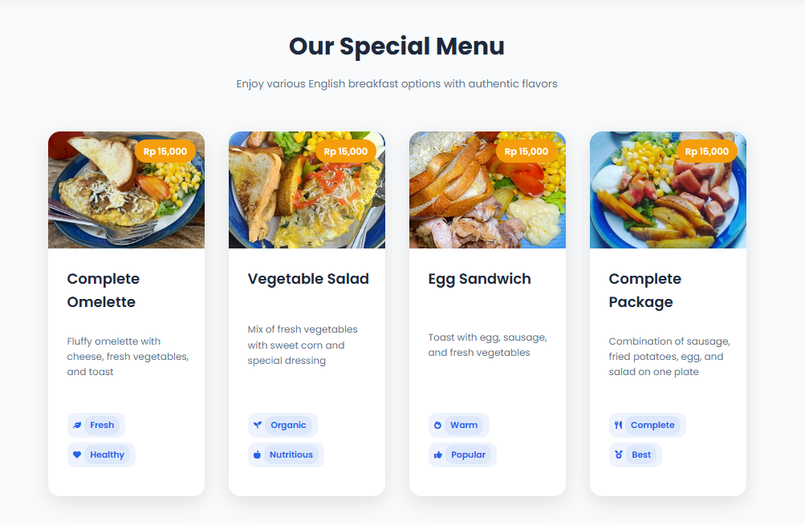
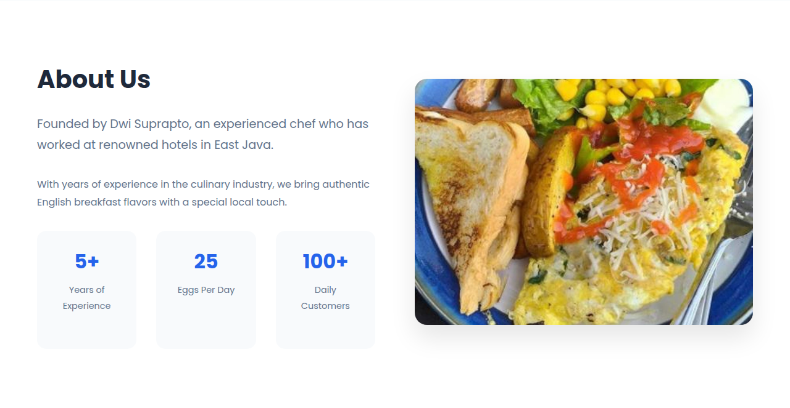
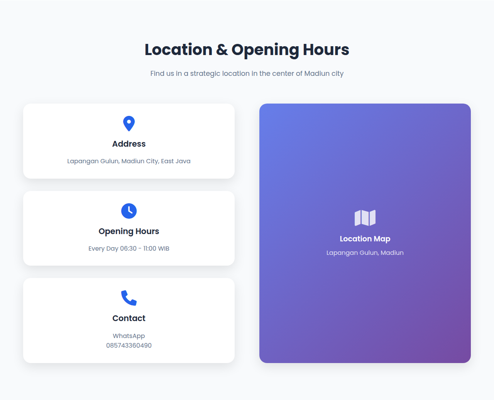
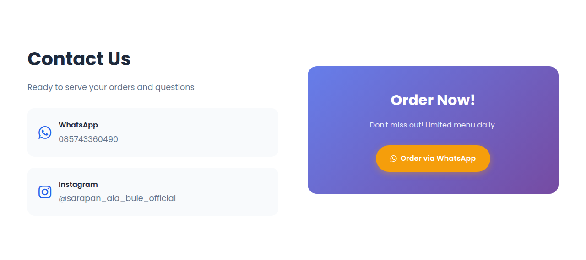
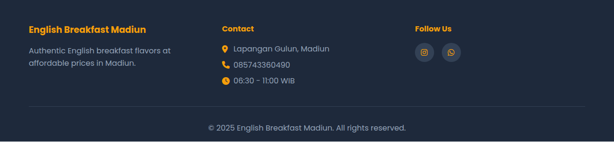

# English Breakfast Madiun - Landing Page

A modern, responsive landing page for **English Breakfast Madiun**, a culinary business that offers authentic English breakfast menus at affordable prices in Madiun, Indonesia.

## Key Features

- **Responsive Navigation Header**  
  Navigation bar with logo, menu links, and hamburger menu for mobile devices. Includes language switcher for English, German, and Indonesian.
  

- **Hero Section**  
  Eye-catching hero section featuring the main title, business description, key features (opening hours, starting price, location), call-to-action buttons, and featured food image.
  

- **Menu Section**  
  Gallery showcasing four signature menu items (Complete Omelette, Vegetable Salad, Egg Sandwich, Complete Package) with images, descriptions, features, and pricing.
  

- **About Us Section**  
  Brief story about the founder (Dwi Suprapto), business experience, and key statistics (years of experience, daily egg consumption, daily customers).
  

- **Location & Opening Hours**  
  Address information, operating hours, contact details, and map location placeholder showing the business location in Lapangan Gulun, Madiun.
  

- **Contact & Ordering**  
  Contact information via WhatsApp and Instagram with quick ordering buttons and call-to-action section.
  

- **Professional Footer**  
  Business information, contact details, social media links, and copyright notice.
  

- **Multi-Language Support**  
  Built-in internationalization (i18n) and localization (l10n) system supporting English (default), German (Deutsch), and Indonesian (Bahasa Indonesia). Language preference is saved in browser local storage.

- **Smooth Animations**  
  Scroll animations, parallax effects, counter animations for statistics, ripple effects on interactions, and smooth page transitions.

- **Mobile Responsive Design**  
  Fully responsive layout that adapts perfectly to all device sizes from mobile phones to desktop computers.

## Technologies Used

- **HTML5** - Semantic markup structure
- **CSS3** - Modern styling with animations and responsive design
- **JavaScript (ES6+)** - Interactive features and dynamic behavior
- **i18n.js** - Custom internationalization system for multi-language support
- **Font Awesome** - Icon library for visual elements
- **Google Fonts** - Poppins typeface for modern design

## Folder Structure

```
landing-page-sarapan-ala-bule-main/
├── README.MD
├── landing_page/
│   ├── index.html          # Main HTML file with i18n attributes
│   ├── style.css           # Styling and responsive design
│   ├── script.js           # Interactive features and language switching
│   ├── i18n.js             # Internationalization system
│   ├── design_structure.md # Design documentation
│   └── images/
│       ├── food_1.jpg      # Omelette image
│       ├── food_2.jpg      # Salad image
│       ├── food_3.jpg      # Sandwich image
│       └── food_4.jpg      # Complete package image
└── readme_img/             # Screenshots for documentation
```

## How It Works

### Navigation & Menus
- Fixed header with sticky positioning for easy access
- Hamburger menu for mobile devices
- Language switcher with 3 language options

### Hero Section
- Prominent tagline and business description
- Key information cards (hours, price, location)
- Call-to-action buttons for menu and ordering
- Parallax scrolling background effect

### Menu Showcase
- Grid layout with 4 signature dishes
- Hover effects showing dish details
- Price overlays and feature tags
- Responsive image gallery

### About Section
- Founder's story and experience
- Animated statistics counter
- Company values and history

### Location Information
- Street address and city details
- Operating hours
- Contact phone number
- Placeholder for location map

### Contact Methods
- WhatsApp direct messaging link
- Instagram social media link
- Quick order buttons
- Ripple effect animations on interaction

### Responsive Behavior
- Mobile menu collapses to hamburger icon
- Images scale appropriately
- Text sizes adjust for readability
- Touch-friendly buttons and links

### Language System
The website includes a complete i18n system:
- **English** (default) - Full English interface
- **Deutsch** (German) - German language interface
- **Bahasa Indonesia** (Indonesian) - Indonesian language interface
- Language preference is stored in browser local storage
- All content updates dynamically when language changes

## Features Implementation

### Smooth Scrolling
Navigation links use smooth scroll behavior for better user experience.

### Scroll Animations
Elements fade in and slide up as they enter the viewport using Intersection Observer API.

### Counter Animation
Statistics numbers animate from 0 to target value when the section becomes visible.

### Parallax Effect
Hero section image moves slightly as users scroll, creating depth perception.

### Mobile Menu Toggle
Hamburger menu expands/collapses for mobile viewing, closes automatically when a link is clicked.

### Hover Effects
Menu items scale and lift up on hover, contact buttons show ripple effects.

### Lazy Loading
Images load only when they enter the viewport for better performance.

### Scroll-to-Top Button
Floating button appears when user scrolls down, allows quick return to top.

## Business Information

- **Business Name:** English Breakfast Madiun
- **Location:** Lapangan Gulun, Madiun City, East Java, Indonesia
- **Operating Hours:** Daily 06:30 - 11:00 WIB
- **Contact:** 085743360490
- **Instagram:** [@sarapan_ala_bule_official](https://instagram.com/sarapan_ala_bule_official)
- **Founder:** Dwi Suprapto

## Menu Items

All items priced at Rp 15,000:

1. **Complete Omelette** - Fluffy omelette with cheese, fresh vegetables, and toast (Fresh & Healthy)
2. **Vegetable Salad** - Mix of fresh vegetables with sweet corn and special dressing (Organic & Nutritious)
3. **Egg Sandwich** - Toast with egg, sausage, and fresh vegetables (Warm & Popular)
4. **Complete Package** - Combination of sausage, fried potatoes, egg, and salad on one plate (Complete & Best)

## Browser Compatibility

- Chrome (latest)
- Firefox (latest)
- Safari (latest)
- Edge (latest)
- Mobile browsers (iOS Safari, Chrome Mobile)

## Performance Features

- Optimized animations with GPU acceleration
- Debounced scroll events
- Efficient DOM queries and caching
- Lazy loading for images
- Minimal CSS bundle size
- No external dependencies except Font Awesome CDN

## Future Enhancements

- Online ordering system integration
- Photo gallery with lightbox
- Customer reviews/testimonials section
- Payment integration
- Blog section for recipes and food stories
- Live location map integration
- Social media feed integration
- Email subscription for promotions

## License

This project is created for promotional purposes for English Breakfast Madiun business.

---

**Made with ❤️ for English Breakfast Madiun**
